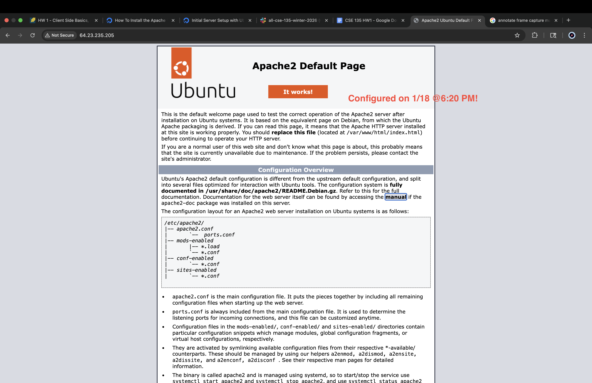
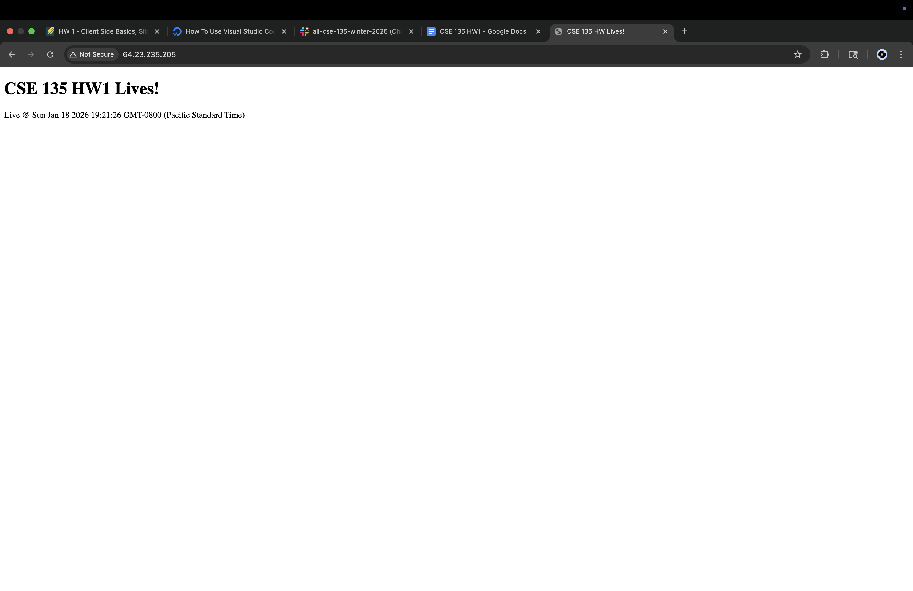
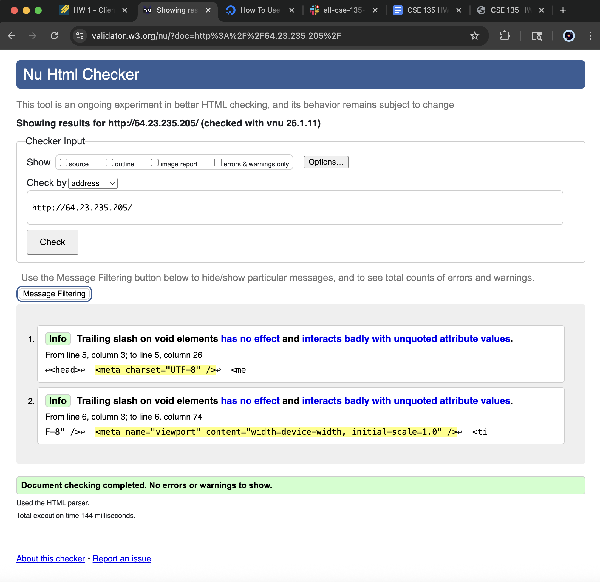
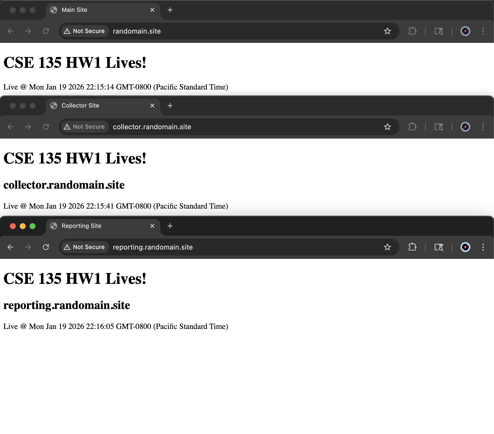
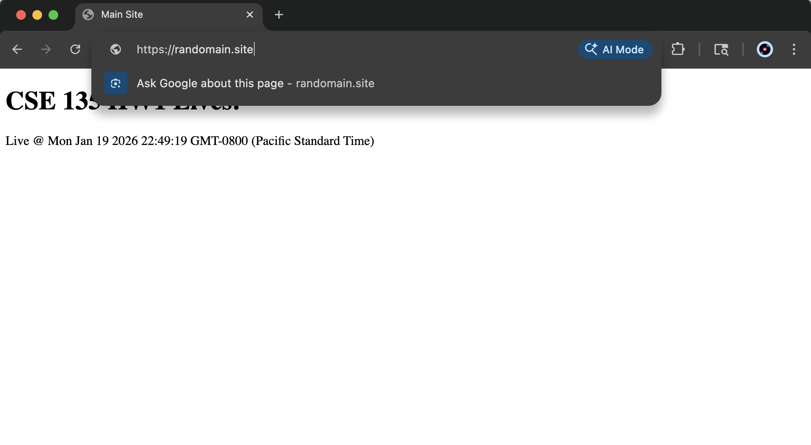

# CSE135 WI26 Homework Center
## Group Members
Ada He  
Carmen He  
## Server Information
Droplet Name: sourdough-library  
IP address: 159.89.132.244  
### Grader Login
Username: grader  
Password: graderaccount!  
## Hosted Site 
Visit [https://randomain.site](our homework site)!  
grader login: grader  
password: grading  
### Autodeploy
Set up through tracking history in special repository of bare copy in remote server, then cloning in the repository and and linking it to push to production copy (the bare copy). The `post-receive` github hook runs scripts that would affect the corresponding index.html page in the randomain.site file. 

## Process Documentation
  
  
  
  
  